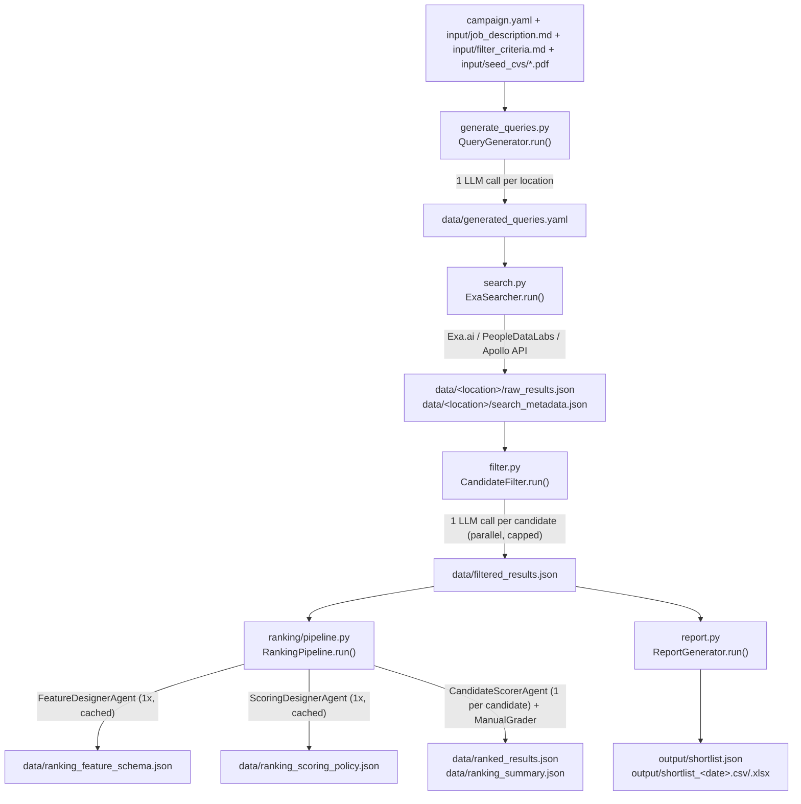

# `candidate_pool/` — Sourcing Pipeline

> Living reference doc. Update this file (not just memory) whenever scripts/behavior change.
> Last generated: 2026-09-09.

## 1. What this is

A standalone Python project (`uv`-managed, Python ≥3.12) that sources and ranks job candidates:

```
generate queries → search (Exa/PDL/Apollo) → AI filter → AI+deterministic rank → report
```

Everything is driven by a **campaign directory** (`campaigns/<name>/`) containing a `campaign.yaml`
config and `input/*.md` briefs. All AI steps are one-shot **headless LLM subprocess calls**
(`claude --print ...` CLI by default, optional GitHub Copilot CLI fallback) — never an interactive
agent loop, no `anthropic` Python SDK dependency at all.

Root entrypoint: `scripts/run_campaign.py`. Also registered as a Claude Code "skill"
(`skill.yaml`, invoked as `/candidate-pool <campaign_dir>`).

### Dependencies (`pyproject.toml`)
| Package | Used for |
|---|---|
| `exa-py>=1.0` | Exa.ai search SDK |
| `pandas>=2.0` | report tabular manipulation |
| `openpyxl>=3.1` | Excel writer engine |
| `python-dotenv>=1.0` | loads `.env` for API keys |
| `pyyaml>=6.0` | campaign.yaml / generated_queries.yaml I/O |
| `pypdf>=4.0` | extracting text from seed CV PDFs |

No `anthropic` SDK — Claude access is 100% via the external `claude` CLI binary.

---

## 2. End-to-end flow



**Note:** `report.py` reads `data/filtered_results.json`, **not** `data/ranked_results.json` — ranking
output is not currently folded into the report artifacts. Flag this if asked to "add ranking to the
report."

### CLI (`scripts/run_campaign.py`)
```
python scripts/run_campaign.py campaigns/<name>/ [flags]
```
| Flag | Effect |
|---|---|
| *(none)* | runs all phases: queries → search → filter → [rank if enabled] → report |
| `--queries-only` | query generation only |
| `--search-only` | query generation (if needed) + search |
| `--filter-only` | filter phase only |
| `--rank-only` | ranking phase only |
| `--report-only` | report phase only |
| `--force-queries` | regenerate queries even if cached |
| `--force-ranking-redesign` | regenerate feature schema + scoring policy even if cached |
| `--filter-max-candidates <int>` | override `filter.max_candidates` |
| `--ranking-max-candidates <int>` | override `ranking.max_candidates` |
| `--filter-max-workers <int>` | override `filter.max_workers` |
| `--ranking-max-workers <int>` | override `ranking.max_workers` |

At the end of every run, `llm_provider`'s usage counters are written to `data/usage_summary.json`
(calls/errors/tokens/cost/duration).

`rank.py` is a standalone alternate entrypoint to the same `RankingPipeline` (useful for iterating
on ranking without re-running search/filter): `python scripts/rank.py campaigns/<name>/ [--force-redesign]`.

---

## 3. Campaign directory structure

```
campaigns/<name>/
├── campaign.yaml
├── input/
│   ├── job_description.md      # required
│   ├── filter_criteria.md      # required by filter.py; optional-ish for query gen
│   ├── seed_cvs/*.pdf          # optional, used by generate_queries.py
│   └── ranking_prompts/*.md    # optional per-key prompt overrides (see §7.3)
├── data/                       # created at runtime
│   ├── generated_queries.yaml
│   ├── <location>/raw_results.json
│   ├── <location>/search_metadata.json
│   ├── filtered_results.json
│   ├── ranking_feature_schema.json
│   ├── ranking_scoring_policy.json
│   ├── ranked_results.json
│   ├── ranking_summary.json
│   └── usage_summary.json
├── output/
│   ├── shortlist.json
│   ├── shortlist_<YYYYMMDD>.csv
│   └── shortlist_<YYYYMMDD>.xlsx
└── logs/run_<YYYYMMDD_HHMMSS>.log
```

### `campaign.yaml` field reference
| Key | Read by | Default |
|---|---|---|
| `name` | run_campaign.py | — |
| `locations[].name` / `.hint` | generate_queries, search | required list |
| `locations[].queries` / `.pdl_queries` / `.apollo_queries` | search.py | manual override, skips AI query gen |
| `search.provider` / `search_api` / `api` | search.py | `"exa"` (or `peopledatalabs`\|`apollo`) |
| `search.num_queries_per_location` | generate_queries.py | 6 |
| `search.num_results_per_query` | search.py | 30 |
| `search.category` | search.py (Exa only) | `"people"` |
| `search.contents.text` / `.highlights.*` | search.py (Exa only) | `{"text": true}` |
| `query_generation.model` | generate_queries.py | `filter.model` → `"claude-sonnet-5"` |
| `filter.max_candidates` | filter.py | 100 |
| `filter.max_workers` | filter.py | 6 |
| `filter.model` | filter.py | `"claude-sonnet-5"` |
| `dedup.existing_pool_path` | search.py | none (relative to campaign_dir) |
| `ranking.enabled` | run_campaign.py | `true` |
| `ranking.model` | ranking/pipeline.py | `filter.model` |
| `ranking.max_features` | ranking/pipeline.py | 10 |
| `ranking.max_candidates` | ranking/pipeline.py | 1000 |
| `ranking.max_workers` | ranking/pipeline.py | = `batch_size` |
| `ranking.batch_size` | ranking/pipeline.py | 50 |
| `ranking.candidate_text_chars` | ranking/pipeline.py | 5000 |
| `ranking.only_accepted` | ranking/pipeline.py | `false` |
| `ranking.force_redesign` | ranking/pipeline.py | `false` |
| `ranking.timeout_seconds` | ranking/pipeline.py | 120 |
| `ranking.{input,output,summary,feature_schema,scoring_policy,job_description,filter_criteria}_path` | ranking/pipeline.py | see file defaults above |
| `ranking.prompts.<key>` | ranking/prompt_store.py | none (see §7.3) |
| `ranking.ai_review_adjustments` | ranking/manual_grader.py | `{ACCEPT:+3, PENDING:0, REJECT:-5}` |
| `output.formats` | report.py | `[excel, csv, json]` |
| `output.keep_rejected` | report.py | `true` |

Example: `campaigns/example_2026-06-09/campaign.yaml` + `input/job_description.md` +
`input/filter_criteria.md` show the canonical shape for an ML/NLP hiring campaign
(Turkey + US-diaspora locations, criteria structured as Accept/Reject/PENDING/Scoring-Guidance
sections).

---

## 4. Script-by-script reference

### 4.1 `scripts/run_campaign.py` — orchestrator
- `_setup_logging(log_dir)` — stdout + timestamped file logging under `logs/`.
- `_load_config(campaign_dir)` — parses `campaign.yaml`.
- `main()` — argparse, applies CLI overrides into the config dict, gates phases (see §2), lazy-imports
  each phase module only when needed, writes `usage_summary.json` at the end.

### 4.2 `scripts/generate_queries.py` — query generation
- `_extract_pdf_text`, `_load_seed_cvs` — pulls text from `input/seed_cvs/*.pdf` (via `pypdf`) to
  enrich the query-generation prompt with "ideal candidate" examples.
- `_call_model(prompt, model)` — calls `llm_provider.call_model_text`, regex-extracts a JSON array
  (`re.search(r"\[.*\]", ...)`) from the raw text.
- **`class QueryGenerator`**
  - `_build_prompt(loc_name, hint)` — fills a template with job description, filter criteria, seed
    CVs, query count, location + hint.
  - `generate_for_location(loc_name, hint)` — one LLM call → list of query strings.
  - `run(force=False)` — caches to `data/generated_queries.yaml`; skips regeneration unless
    `force=True` (i.e. `--force-queries`).
- **Notable hard-coded convention:** the prompt template requires every generated query to
  explicitly negate "does not work at ING" — business-specific logic baked into shared code, not
  general-purpose. Flag before reusing this pipeline for a different hiring org.

### 4.3 `scripts/search.py` — multi-provider search
**`class ExaSearcher`** (name is legacy; supports 3 providers via `search.provider`):
- Provider init requires the matching API key: `EXA_API_KEY` / `DATALABS_API_KEY` / `APOLLO_API_KEY`.
- `_load_existing_pool()` — optional dedup against `dedup.existing_pool_path`.
- `_build_pdl_sql_queries` / `_build_apollo_query_params` — hard-coded ML/AI-hiring-flavored
  fallback query templates (used only if `campaign.yaml` doesn't set `pdl_queries`/`apollo_queries`
  explicitly) — domain-specific boilerplate.
- `_pdl_search_request` / `_apollo_search_request` — raw `urllib.request` POST/GET calls to the
  PeopleDataLabs/Apollo REST APIs (no SDK).
- `_convert_pdl_record` / `_convert_apollo_record` — normalize provider-specific records into the
  pipeline's common candidate schema: `url, title, score, published_date, text, highlights,
  highlight_scores, query, location, search_bucket, source, info, scraped_at`.
- `_search_query` (Exa via `exa_py`), `_search_pdl_query`, `_search_apollo_query` — per-provider
  search+normalize+dedupe.
- `_load_queries_for_location(location)` — provider dispatch: manual `queries`/`pdl_queries`/
  `apollo_queries` override in campaign.yaml, else generated/built-in queries.
- `run()` — per location, writes `data/<location>/raw_results.json` +
  `data/<location>/search_metadata.json`.

### 4.4 `scripts/filter.py` — AI accept/reject/pending classification
- `_extract_json(text)` — **simple regex** JSON object extractor, only reliably handles one level
  of nested braces (contrast with the more robust extractor in `ranking/utils/json_utils.py`, §4.9).
- **`class CandidateFilter`**
  - `_review_candidate(candidate)` — builds a summary (url/title/location/highlights/text excerpt
    ≤3000 chars), calls the model, merges the AI-derived `candidate_location`/`candidate_job_title`
    back onto the candidate (overriding the raw search-bucket location, which is not verified fact).
    On failure, substitutes a graceful `PENDING`/`LOW` stub review — **never crashes the batch**.
    Controlled by env var `CANDIDATE_POOL_FAIL_MODE` (`pending` default, or `reject`) — `reject`
    is a dev-only speed knob for fast local iteration; never set it on the deployed server, since
    it silently drops real candidates instead of flagging them for manual review on any failure
    (timeout, auth outage, etc.).
  - `_select_candidates_for_review(all_candidates)` — **query-balanced capped selection**: groups
    candidates by `(search_bucket, query)`, takes each group's top-scoring candidate first (ensures
    every query gets at least one review before the cap is spent), then round-robins remaining
    slots by score — prevents one high-volume query from starving others.
  - `run()` — reviews up to `filter.max_candidates` in parallel via
    `ThreadPoolExecutor(max_workers=filter.max_workers)`; candidates beyond the cap get a synthetic
    PENDING stub (`"Not reviewed — beyond max_candidates cap"`), not dropped. Writes
    `data/filtered_results.json`.

### 4.5 `scripts/rank.py` — standalone ranking entrypoint
Thin CLI wrapper: loads config, applies `--force-redesign`, runs `RankingPipeline(...).run()`.
Equivalent to `run_campaign.py --rank-only` but independent of the rest of the pipeline.

### 4.6 `scripts/report.py` — shortlist output
- `_flatten(candidate)` — merges `ai_review` fields into the top level with an `ai_` prefix for flat
  tabular rows.
- **`class ReportGenerator`**
  - `run()` — reads `data/filtered_results.json`, writes `output/shortlist.json` (**all fields
    preserved**, designed to feed downstream scoring), splits into accepted/rejected/pending by
    `ai_review.recommendation`, then `_write_csv`/`_write_excel` per `output.formats`.
  - `_write_excel` — `pandas.ExcelWriter(engine="openpyxl")`, 3 sheets: `Summary`, `Approved`,
    `Rejected_Pending` (if `output.keep_rejected`).

### 4.7 `scripts/llm_provider.py` — shared LLM chokepoint
Every LLM call in the pipeline (`generate_queries.py`, `filter.py`,
`ranking/agents/agent_base.py`) flows through this module's `call_model_text`.

- **Provider choice** (`choose_provider()`): env var `CANDIDATE_POOL_LLM_PROVIDER` (`claude`/
  `copilot`) wins if set; otherwise heuristically picks `copilot` if the local git/`gh` identity
  matches `CANDIDATE_POOL_COPILOT_USERS` (default `"MG77XN_ingcp"`), else defaults to `claude`.
- **Claude CLI invocation pattern** (the "minimal overhead" convention — see PLAN.md history):
  ```
  ["claude", "--print", "--model", <model>, "--tools", "", "--output-format", "json"]
    + (["--system-prompt", <system>] if system given)
  ```
  `--tools ""` strips Claude Code's built-in tool definitions; explicit `--system-prompt` replaces
  its default agentic system prompt. This cut ~17,900 → ~170 tokens of fixed per-call overhead —
  critical since `filter.py`/ranking make **one call per candidate** (40–200+ per campaign).
- **Multi-profile fallback chain**: `CLAUDE_PROFILES_DIR` (hard-coded
  `/home/osman/n8n-data/claude-profiles`, prod-server-specific) + `CLAUDE_PROFILE_CHAIN` (env
  `CANDIDATE_POOL_CLAUDE_PROFILES`, default `"aiworkspacetr,richard"`) — tries isolated Claude CLI
  `$HOME` profiles in order, falling through only on retryable failures (timeout, non-zero exit,
  `is_error`), not on "binary missing".
- **Thread-safe usage accumulator** (`_usage_totals` + `threading.Lock`) — tracks calls/errors/
  tokens/cost/duration across concurrent `ThreadPoolExecutor` calls from `filter.py`/ranking.
- `call_model_text(*, prompt, model, system, timeout)` — the universal entrypoint; never raises,
  returns `None` on any failure.

### 4.8 `scripts/llm_client.py` — Copilot CLI wrapper
**`class CopilotClient`** — subprocess wrapper around the `copilot` binary (used only when
`choose_provider()` picks Copilot). Parses the Copilot CLI's JSON-lines streamed output
(`assistant.message` / `assistant.message_delta` / `result` events).

⚠️ **Security note**: runs `copilot` with `--allow-all-tools --allow-all-paths --allow-all-urls` —
broad, unrestricted permissions for what should be a one-shot classification call. Inconsistent
with the Claude path's `--tools ""` (fully locked down). Worth hardening if this path is ever
exercised in production.

### 4.9 `scripts/ranking/` — ranking sub-pipeline

**`pipeline.py` — `class RankingPipeline`**
1. `_load_candidates()` — reads `filtered_results.json`, optional `only_accepted` filter, cap to
   `max_candidates`.
2. `_load_or_build_feature_schema()` — cached at `ranking_feature_schema.json` unless
   `force_redesign`; **fallback schemas are never cached** (so a future run retries proper AI
   design instead of getting stuck with a generic schema).
3. `_load_or_build_scoring_policy()` — cached at `ranking_scoring_policy.json` (always cached, no
   fallback concept here).
4. Scores candidates in batches (`ranking.batch_size`, default 50) via
   `ThreadPoolExecutor(max_workers=ranking.max_workers)`: `CandidateScorerAgent.score_candidate()`
   → `ManualGrader.grade()`.
5. Re-sorts by original index (restore determinism after thread completion order), then by
   `(manual_score, exa_score)` descending, assigns `rank`.
6. Writes `ranked_results.json` + `ranking_summary.json` (tier counts + top 10).

**`prompt_store.py` — `class PromptStore`**: resolves each of 6 prompt keys
(`feature_designer_system/user`, `scoring_designer_system/user`, `candidate_scorer_system/user`) in
order: (1) explicit path in `ranking.prompts.<key>`, (2) `input/ranking_prompts/<key>.md`
convention, (3) built-in `DEFAULT_PROMPTS`.

**`agents/agent_base.py` — `class JsonAgent`**: shared `call_json(system, user, retries=1)` —
calls `llm_provider.call_model_text`, parses with the robust `extract_first_json_object`, retries
up to `retries+1` times total.

**`agents/feature_designer_agent.py` — `FeatureDesignerAgent(JsonAgent)`**: turns job description +
filter criteria into a role-specific list of scoring features (id, name, max_points, description,
extraction_logic, evidence_examples). ⚠️ **Fallback history**: an earlier version's fallback
schema hard-coded NLP/LLM/Python-flavored features, silently biasing *every* campaign's scoring
toward NLP candidates whenever AI design failed (found via recruiter complaints). Now falls back
to a generic 2-feature schema (`criteria_match`, `seniority`) instead — **do not reintroduce
domain-specific fallback features here.**

**`agents/scoring_designer_agent.py` — `ScoringDesignerAgent(JsonAgent)`**: assigns feature
weights (normalized to sum exactly 100, remainder distributed to largest fractional parts), hard
gates (`must_have`/`reject_if` → gate objects with `penalty: "REJECT"`), and A/B/C tier score
thresholds (default 85/70/55, enforced monotonic).

**`agents/candidate_scorer_agent.py` — `CandidateScorerAgent(JsonAgent)`**: per-candidate call —
returns `feature_assessments` (raw points 0..max per schema feature, clamped/coerced) +
`gate_flags`. Iterates the **schema's** feature list (not the model's raw output) to guarantee
exactly one row per feature even if the model hallucinates/omits entries.

**`manual_grader.py` — `class ManualGrader`**: the deterministic, non-LLM scoring layer.
$$\text{contribution}_f = w_f \cdot \text{clamp}\left(\frac{\text{raw\_points}_f}{\text{max\_points}_f}, 0, 1\right)$$
$$\text{total} = \sum_f \text{contribution}_f + \text{gate\_penalty} + \text{ai\_adjustment}$$
$$\text{manual\_score} = \text{clamp}(\text{total}, 0, 100)$$
`ai_adjustment` comes from the **filter phase's** AI recommendation (`ACCEPT: +3, PENDING: 0,
REJECT: -5` by default) — lets the earlier filter decision nudge the final rank. Any triggered
`REJECT`-penalty gate forces category `"D"` regardless of numeric score.

**`utils/json_utils.py`**: `extract_first_json_object(text)` — a **brace-depth-counting parser**
that correctly skips braces inside quoted strings and handles arbitrary nesting — more robust than
`filter.py`'s regex-based extractor. `ensure_list`/`ensure_dict` — type-coercion helpers.

**`RANKING.md`** — an already-thorough design doc for this sub-module (module map, I/O contracts,
grading formula, output schemas, prompt override resolution). Read it directly for ranking-specific
deep dives instead of duplicating further here.

---

## 5. Notable conventions & gotchas (for future work in this repo)

1. **Two different JSON-extraction implementations coexist**: `filter.py`/`generate_queries.py`
   use naive regex (one level of brace nesting only); `ranking/utils/json_utils.py` uses a proper
   brace-depth counter. Candidate for future unification — don't assume `filter.py`'s extractor
   handles nested JSON correctly.
2. **Graceful degradation everywhere**: a failed/malformed LLM call never aborts a whole batch —
   filter and ranking both substitute low-confidence stub results and keep going.
3. **Caching with a "don't cache broken results" exception**: `generated_queries.yaml`,
   `ranking_feature_schema.json`, `ranking_scoring_policy.json` are cached to avoid repeat LLM
   cost — except fallback feature schemas are deliberately never persisted.
4. **Two independent provider-selection axes**: `search.provider` (exa/peopledatalabs/apollo) for
   candidate sourcing vs. `llm_provider.choose_provider()` (claude/copilot) for LLM calls — unrelated
   to each other, don't conflate when debugging.
5. **Deployment-specific hard-coded paths**: `CLAUDE_PROFILES_DIR` (Linux server path) and the
   Copilot CLI macOS fallback path in `llm_client.py` are environment-specific; they degrade
   gracefully if absent but are not portable.
6. **`report.py` does not consume ranking output** — if asked to include rank/score in the
   shortlist report, that's a real gap to close, not a misunderstanding.
7. **PLAN.md in this directory is a cost/token-reduction changelog**, not a general roadmap — next
   levers noted there: batch multiple candidates per filter/ranking LLM call, and consider
   downgrading filter/ranking model to `claude-haiku-4-5` after a quality spot-check.
